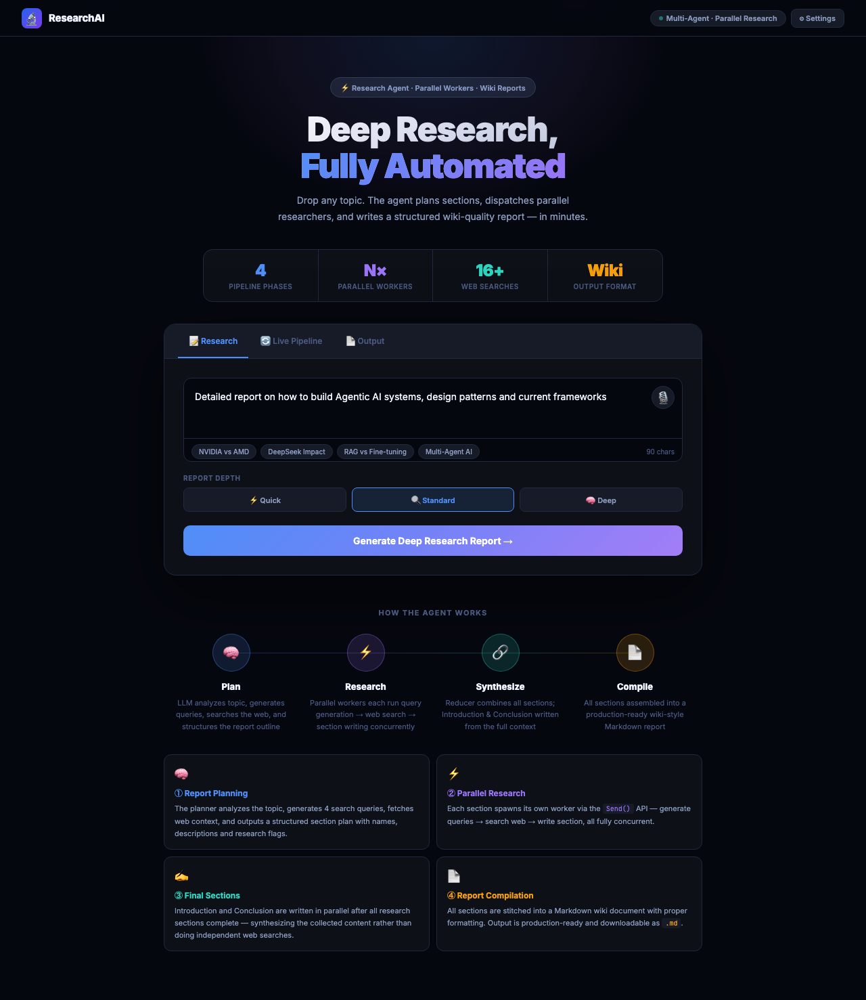
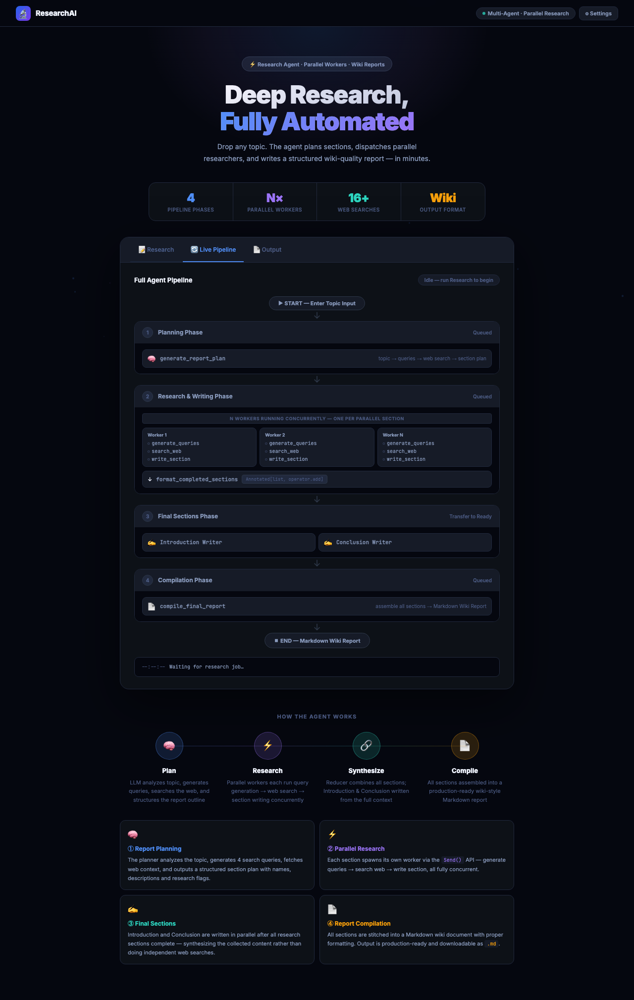
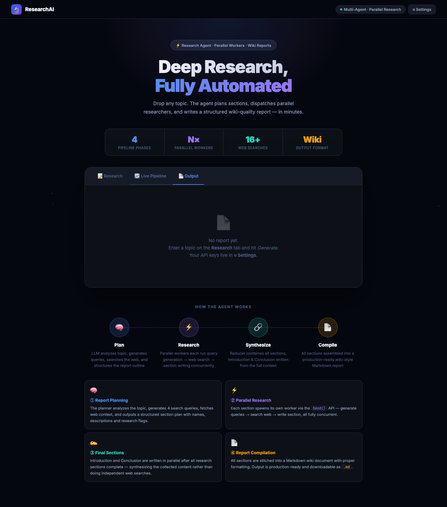
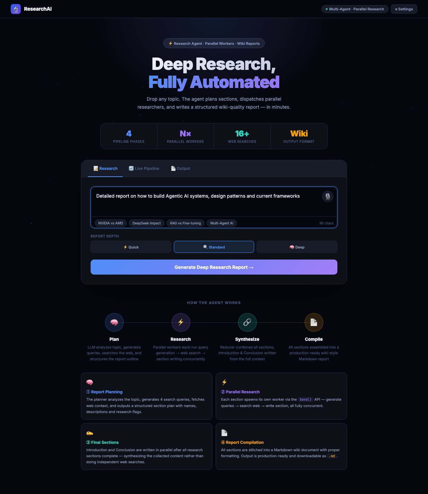

# 🔬 ResearchAI — Deep Research, Fully Automated

> A multi-agent AI system that researches any topic on the web, synthesises a structured report, and publishes it as a blog post — all in real time.



## Live Demo

[](https://researchai-3706.onrender.com)
[](https://github.com/ankitsharma6652/researchai)

---

## What it does

Type any topic → 4 parallel AI agents plan, research, synthesise, and compile a full structured report with sources — streamed live to your browser. Then convert it to a blog post and publish to dev.to or LinkedIn in one click.

---

## Screenshots

### Home — Enter your research topic


### Live Pipeline — Watch every agent step stream in real time



### Output — Full structured report with sources



### Blog Editor — Edit, preview, publish


### Research in progress



---

## Architecture

```
User Topic
    │
    ▼
Plan Agent  ──── generates section outline
    │
    ▼
Parallel Section Agents (LangGraph Send fan-out)
    │   ├── Query Generator   (Tavily search queries per section)
    │   ├── Web Searcher      (parallel Tavily API calls)
    │   └── Section Writer    (LLM synthesises search results)
    │
    ▼
Report Compiler  ──── merges all sections → markdown report
    │
    ▼
Blog Generator + Publisher  ──── dev.to / LinkedIn
```

---

## Features

- **LangGraph multi-agent graph** — parallel section research using `Send()` fan-out
- **Real-time SSE streaming** — every agent step streams live to the browser
- **Multi-provider LLM** — Groq, Gemini, OpenAI, NVIDIA NIM, any OpenAI-compatible endpoint
- **Tavily web search** — live internet research, not hallucinations
- **Markdown editor** — full editor with live preview, Mermaid diagrams, syntax highlighting
- **One-click publish** — dev.to API + LinkedIn UGC Posts v2

---

## Tech Stack

| Layer | Tech |
|---|---|
| Backend | FastAPI + Python |
| Agent framework | LangGraph (`StateGraph`, `Send`) |
| LLM | LangChain (Groq / Gemini / OpenAI) |
| Web search | Tavily Search API |
| Streaming | Server-Sent Events (SSE) |
| Frontend | Vanilla JS + Marked.js + Highlight.js + Mermaid.js |
| Publish | dev.to v1 API, LinkedIn UGC Posts v2 |
| Hosting | Render (free, keep-alive) |

---

## Environment Variables

| Variable | Where to get it |
|---|---|
| `GROQ_API_KEY` | [console.groq.com](https://console.groq.com) |
| `GEMINI_API_KEY` | [aistudio.google.com](https://aistudio.google.com) |
| `TAVILY_API_KEY` | [tavily.com](https://tavily.com) |
| `DEVTO_API_KEY` | dev.to → Settings → Extensions |
| `LINKEDIN_ACCESS_TOKEN` | LinkedIn Developer Portal |
| `LINKEDIN_AUTHOR_URN` | `urn:li:person:XXXXXX` |

---

## Run Locally

```bash
git clone https://github.com/ankitsharma6652/researchai
cd researchai
pip install -r requirements.txt
cp .env.example .env   # fill in your keys
uvicorn server:app --reload --port 8000
# Open http://localhost:8000
```

---

*Built by [Ankit Sharma](https://github.com/ankitsharma6652) · 2025*
